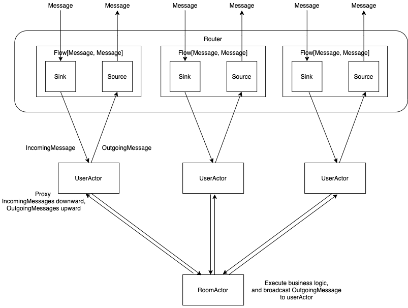

# agario_clone

[agar.io](https://agar.io) 클론 코딩

## tech stack

- Scala
- Akka Http, Akka Stream, Akka Actor
- Websocket
- spray-json

## 요구사항

- 유저는 하나의 원으로 표현되고, 큰 원이 작은 원을 잡아먹음으로써 크기를 키워나가는 게임
- 두 원의 중심 사이의 거리가 큰 원의 반지름보다 작으면 작은 원이 큰 원에게 잡아먹힘
- 다른 유저를 잡아먹지 않아도 바닥에 뿌려져 있는 먹이를 통해 성장이 가능하며, 이 먹이는 주기적으로 공급됨

## server structure



## Akka Stream으로 Websocket router 작성하기

webSocket 통신은 http 통신과 다르게 request가 오면 그에 따른 response를 내려주는 것이 아니라, 한번 커넥션이 형성되면 client와 server 각각의 독자적인 logic에 따라 client to server message와 server to client message가 자유롭게 오고갈 수 있다.
이는 Reactive Stream API를 구현하고 있는 Akka Stream의 성질과 잘 어울리며, 특히 하나의 input stream과 하나의 output stream을 각각 들고 있는 Flow라는 녀석을 적극적으로 활용할 수 있다.

```scala
val route: Route =
  parameter(Symbol("id"), Symbol("username")) { (id, userName) =>
    get {
      handleWebSocketMessages(newUser(UUID.fromString(id), userName))
    }
  }
  
def newUser(userId: UUID, userName: String): Flow[Message, Message, NotUsed]
```

그리고 이 Flow는 다양한 방법으로 생성할 수 있는데, 특히 input stream과 output stream이 서로 연결되도록 만들 수도 있고 그렇지 않게 할 수도 있다. Websocket connection에서는 incoming message를 받고 outgoing message를 보내는 작업이 따로따로 이루어져야 하므로 input stream과 output stream이 연결되어 있지 않은 Flow를 생성해야 한다. 이는 `Flow.fromSinkAndSource`라는 함수를 쓰면 가능한데, 이 함수의 주석을 살펴보면 다음과 같다.

```scala

  /**
   * Creates a `Flow` from a `Sink` and a `Source` where the Flow's input
   * will be sent to the Sink and the Flow's output will come from the Source.
   *
   * The resulting flow can be visualized as:
   * {{{
   *     +----------------------------------------------+
   *     | Resulting Flow[I, O, NotUsed]                |
   *     |                                              |
   *     |  +---------+                  +-----------+  |
   *     |  |         |                  |           |  |
   * I  ~~> | Sink[I] | [no-connection!] | Source[O] | ~~> O
   *     |  |         |                  |           |  |
   *     |  +---------+                  +-----------+  |
   *     +----------------------------------------------+
   * }}}
   *
   * The completion of the Sink and Source sides of a Flow constructed using
   * this method are independent. So if the Sink receives a completion signal,
   * the Source side will remain unaware of that. If you are looking to couple
   * the termination signals of the two sides use `Flow.fromSinkAndSourceCoupled` instead.
   *
   * See also [[fromSinkAndSourceMat]] when access to materialized values of the parameters is needed.
   */
  def fromSinkAndSource[I, O](sink: Graph[SinkShape[I], _], source: Graph[SourceShape[O], _]): Flow[I, O, NotUsed]
```

그러므로 router에서 해야할 일은 Sink와 Source를 만들어 business logic을 수행할 Actor와 연결시켜주고, 이 두 개를 하나의 Flow로 합쳐주는 것이다.

```scala
val incomingMessages: Sink[Message, NotUsed] = {...}

val outgoingMessages: Source[Message, NotUsed] = {...}

Flow.fromSinkAndSource(incomingMessages, outgoingMessages)
```

## Akka Actor를 이용한 Domain Object 관리

UserActor와 RoomActor를 만들어 UserActor는 Message를 위아래로 전달해주기만 하고, RoomActor는 UserActor로부터 Message를 받아 적절한 business logic을 수행하고 응답 Message를 broadcast하는 역할을 하도록 만들었다.

```scala
class UserActor(room: ActorRef) extends Actor {
  import UserActor._

  def receive = {
    case Connected(outgoing, userId, username) =>
      context.become(connected(outgoing, userId, username))
  }

  def connected(outgoing: ActorRef, userId: UUID, username: String): Receive = {
    room ! RoomActor.Join(userId, username)

    {
      case incomingMessage: IncomingMessage =>
        room ! incomingMessage // incomingMessage를 Room으로 transfer
        
      case outgoingMessage: OutgoingMessage => // outgoingMessage를 Router로 transfer
        outgoing ! outgoingMessage
    }
  }
}

class RoomActor extends Actor {
  var users: concurrent.Map[UUID, (User, ActorRef)] = concurrent.TrieMap.empty
  var preys: concurrent.Map[UUID, Prey] = initPreys

  def receive = {
    case Join(userId, username) => ~~

    case Terminated(user) => ~~

    case IncomingMessage(userId, message) => 
      message match { // incomingMessage의 type별로 business logic 수행
        case PositionChangeBody(position) => ~~
        case MergeBody(colonyId) => ~~
        case EatBody(preyId) => ~~
      }
  }

  private def broadCast(messageBody: OutgoingMessageBody): Unit = users.values.foreach(_._2 ! OutgoingMessage(messageBody))
}
```

## spray-json을 이용한 WSMessage parsing

Websocket Message는 Json 형식으로 주고받기로 프론트엔드 개발자와 합의하였고, 그에 따라 아래 2가지 작업을 해주어야 했다.
- Json String으로 날아온 Message를 IncomingMessage로 변환
- OutgoingMessage를 Json으로 Stringify

이 작업을 하기 위해 spray-json을 이용했으며, snake case로 정의된 Json key들을 camel case로 자동 변환해주기 위해 아래와 같은 converter를 작성했다.
```scala
trait SnakifiedSprayJsonSupport extends DefaultJsonProtocol {
  import reflect._

  override protected def extractFieldNames(classTag: ClassTag[_]) = {
    import java.util.Locale

    def snakify(name: String) = PASS2.replaceAllIn(PASS1.replaceAllIn(name, REPLACEMENT), REPLACEMENT).toLowerCase(Locale.US)

    super.extractFieldNames(classTag).map(snakify)
  }

  private val PASS1 = """([A-Z]+)([A-Z][a-z])""".r
  private val PASS2 = """([a-z\d])([A-Z])""".r
  private val REPLACEMENT = "$1_$2"
}

object SnakifiedSprayJsonSupport extends SnakifiedSprayJsonSupport
```